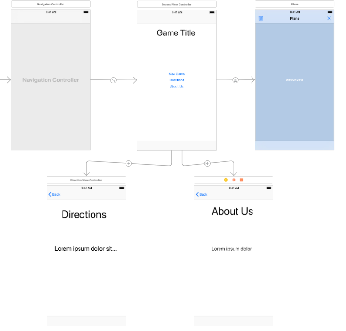
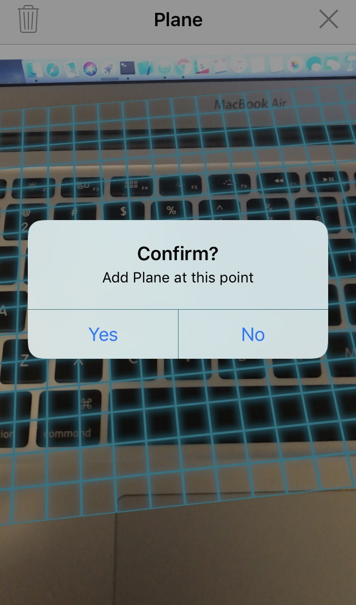
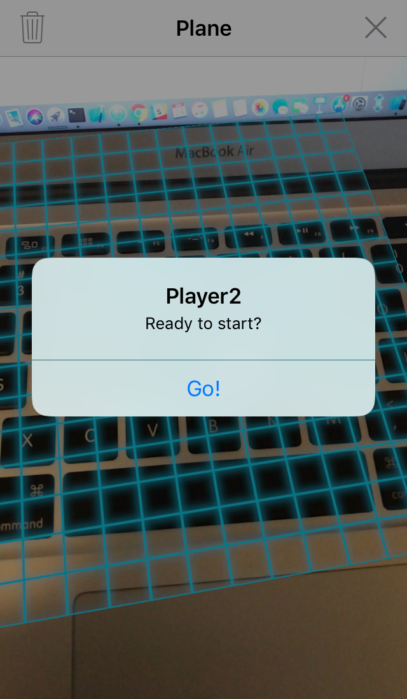

# Peekaboo

## Background and Overview

## Functionality and MVP
### Terminology
Treasure: hidden object
Hider: Player who hides the “Treasure”
Seeker: Player who searches for the “Treasure”
Game: Includes Placing and Searching state
Search state: period of the game where the seeker is looking for the “Treasure”
### Base Gameplay Logic
- [ ] Hider will be able to attach an digital object on to a physical surface for a Seeker to find
- [ ] Hider and Seeker will have limited time to place and find the object
- [ ] Either player loses on timeout
- [ ] “Treasure” will be invisible until Seeker is within a set distance of the object at which point audio feedback will be given
- [ ] Seeker will be able to tap on the “Treasure” to win the game
- [ ] If the Seeker gives up, the location will be revealed by the “Treasure” becoming visible and growing

 ## User Interface and Experience
- [ ] App will include a main menu with a “Start Game” button, directions, and an about page
- [ ] “Start Game” starts the hiding countdown, opens the camera, and tells the hider to place the “Treasure”
- [ ] Hider will be able to confirm or deny the correct placement of the object or cancel the game
- [ ] If Hider runs out of time, a losing message is displayed which allows for a new game to start

 - [ ] The Game will have a staging screen for letting the Hider hand over the phone to the Seeker who can activate the Search
- [ ] The Searching state will let the Seeker find the object, or give up
- [ ] The Searching state ends with give up or timeout with will a winning or losing message, allowing the user to start a new Game
- [ ] UX will be adequately styled with smooth, bug-free navigation

 ## Documentation
- [ ] Full readme
- [ ] Demo Site
- [ ] App Store details

### Bonus Features
- [ ] Single player version
- [ ] Instructions and UI components rendered in AR

## Wireframes
The application will consist of 4 views, outlines in the image below. There will be a main navigation view that directs the user to the other 3 views. There will be a Directions view, explaining the rules of the game to the user. There will be an 'About Us' view, with basic details about the application and the development team. And there will be an `ARSCNVIEW` or Augmented Reality Scene View, where nearly all of the

The `ARSCNVIEW` will consist of basic navigation buttons, pop-ups and prompts to the user to confirm object location or start the 2nd player's turn, etc. Most of the application will take place through the users's camera with prompt's and pop-ups similar to the images below.

A full storyboard view of application is available in the Planning Docs folder.

## Technologies and Technological Challenges
This mobile iOS application will be built in Swift, using xCode 9.4 - Apple’s Model-View-Controller (MVC) framework and development environment. Given project time constraints, building this app in Swift has a few key advantages:

* Access to ARKit, Apple’s developers toolkit for augmented reality apps
* Access to SceneKit, Apple’s software for creating and using 3d models
* For our minimum viable product, there will be no need to set up a backend (all data can be stored on the user’s device)
* Building a native app allows for more control in AR than we would have with cross platform technologies

Technical challenges for this project will include:
* Learning new tech (Swift, xCode and ARKit) to quickly build and deploy a mobile app
* Rendering and interacting with objects in augmented reality
* Determining relative distance in 3d space between objects and registering events depending on that distance
* Creating a fun user experience on a medium for which we have not developed before (mobile)

## Completed over the weekend
To get up to speed with the new technologies, each team member completed the following:
* Tutorials: 2-3 online courses specific to Swift, ARKit and iOS development
* Docs: Overview of documentation for Swift, xCode, ARKit and SceneKit
* Demo Apps: Build at least one simple demo app on personal device
* Demo Site - Decided on template
* Object - Decided on 3d object to render
* Basic UI - components (e.g Fonts)

To get started on this project, the following was completed:
* Setup - Github Repo and initial xCode project
* Created basic views in order to run the application
* Basic UI setup using some demo code and objects to test functionality
* Identified template for Demo Site
* Determined 3d object model and animations to use as primary hidden object

## Group Members and Responsibilities
The team includes 4 members: Charlie Thomas, Aakash Sarang, Nate Cunha, and Daniel Chen

Charlie’s primary responsibilities include:
* Managing Timeline
* Logic for object hit testing (user can tap on an object to end the game)
* Handling the game’s Win condition(s) and outcome
* Writing the game directions/rules to be displayed to the user
* Getting Application deployed on the app store

Aakash’s primary responsibilities include:
* Feature Manager - Game functions as planned
* Handles all button actions and transitions
* Logic for quit/lose conditions and game restart
* Writing the ‘About Us’ section of the app

Nate’s primary responsibilities include:
* UX Manager - The game runs smoothly and is fun to play
* Play testing manager - Gather playtest feedback to improve game
* Logic for calculating relative distances in 3D space
* Handles location-based events (e.g. to provide user with feedback)

Daniel’s primary responsibilities include:
* UI Manager - The game layout is intuitive and aesthetically pleasing
* Rendering and placement of objects in 3D space
* Styling ‘Directions’ & ‘About Us’ views
* Manage Demo Site setup (will be assisted by all)

## Schedule & Work Breakdown

Each day will begin with a Stand Up meeting at 9:05am to review the schedule and goals for the day, discuss roadblocks, and adjust the schedule and workload as needed. Each day will conclude with one person doing a code review for another on the team.

### Phase 1 - Basic Game Logic - (2.5 days)
* All UI components (unstyled) are in place (Daniel)
* 3D Object render in user designated placements (Daniel)
* Button actions are linked to View Controller and functional (Aakash)
* Transition between views are functional (Aakash)
* Object hitTesting is functional (Charlie)
* Basic Win conditions (Charlie)
* Basic Lose/Quit conditions (Aakash)
* Distance relative to origin / user is calculated (Nate)
* Object rendering distance events are functional (Nate)
* Game Directions are complete (Charlie)
* About Us section is complete (Aakash)

### Phase 2 - Polish and Playtest (1.5 days)
* PlayTest (All)
* Gather playtest feedback and provide adjustments needed (Nate)
* UX/UI adjustments based on playtest feedback (All)
* User feedback distance events are functional (Nate)
* Timer(s) are functional (Charlie)
* Timer events are functional (Nate)
* Finalize Plane detection logic (Daniel)
* UI components are styled appropriately (Daniel)
* Advanced win conditions are complete (Charlie)
* Advanced lose conditions are complete (Charlie)

### Phase 3 - Go Live - (1 day)
* Final styling/UI/UX adjustments (Aakash and Nate)
* Gather final assets and info needed to submit to App store (Aakash and Nate)
* Submit to the App Store for review (Charlie)
* Register Domain for Demo Site (Charlie)
* Build Demo Site (Daniel + All)

***

## Getting Users and Reviews
* Charlie will submit the app for review on the App store.
* All members will each share with at least 20 friends and family members.
* Soft launch with close friends.
